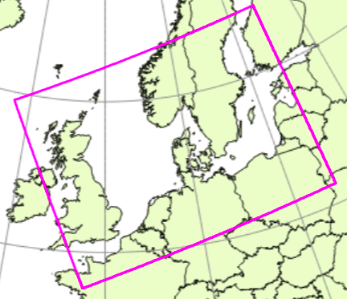

# Introduction@id:ms-python.python

The DANish ReAnalysis (DANRA) is a high resolution regional atmospheric reanalysis for Denmark and surrounding regions using the state-of-the-art Harmonie Numerical Weather Prediction (NWP) assimilation and forecast system, providing information about weather related variabilites and climate change in the recent past.

DANRA is a project within the National Center for Climate Reseach (NCKF) at the [Danish Meteorological Institute](https://www.dmi.dk/).

The DANRA is targeted to create a 70-year atmospheric reanalysis for Danish area with the Harmonie-based reanalysis system at a 2.5 km grid resolution. A near term goal is to deliver a 30+ year reanalysis for 1991-2020 by mid-2023.

## Domain
The DANRA reanalysis is performed over a domain covering the large part of north-western Europe centralised around Denmark.

